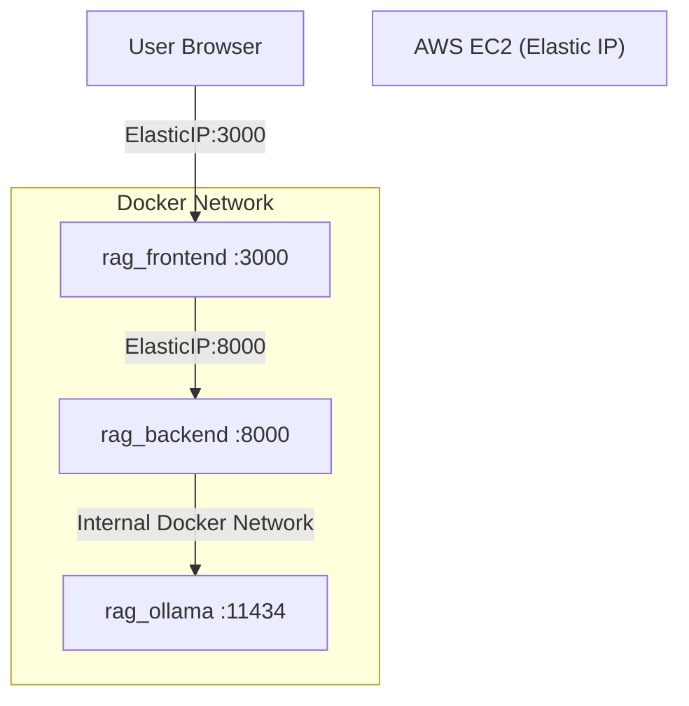

# RAG-Based AI Assistant Deployment Guide (AWS EC2 + Docker + Ollama)

This document explains how to deploy the RAG-Based AI Assistant on a fresh AWS EC2 Ubuntu instance using an **Elastic IP** (recommended for production stability).

---

# 🌐 Why Elastic IP?

By default, AWS assigns a **temporary public IP** to your EC2 instance.

⚠️ If you stop/start the instance, that public IP changes.

An **Elastic IP (EIP)** is a static public IP address that:
- Does NOT change after restart
- Can be reassociated if needed
- Is safe to use in frontend environment variables
- Is safe to share publicly

✅ Always use Elastic IP in production deployments.

---

# 1️⃣ Launch EC2 Instance

- Instance Type: **t3.large (recommended minimum 8GB RAM)**
- OS: **Ubuntu 24.04 LTS**
- Open Ports in Security Group:
  - 22 (SSH)
  - 3000 (Frontend)
  - 8000 (Backend)

After launching:
👉 Allocate an **Elastic IP**
👉 Associate it with your EC2 instance

---

# 2️⃣ Connect to EC2 (Using Elastic IP)

On your local machine:

```bash
chmod 400 rag-deploy-key.pem
ssh -i rag-deploy-key.pem ubuntu@<YOUR_ELASTIC_IP>
```

Example:

```bash
ssh -i rag-deploy-key.pem ubuntu@54.79.153.24
```

---

# 3️⃣ Update System

```bash
sudo apt update && sudo apt upgrade -y
```

---

# 4️⃣ Install Docker

```bash
sudo apt install -y docker.io docker-compose-plugin
sudo systemctl enable docker
sudo systemctl start docker
sudo usermod -aG docker ubuntu
newgrp docker
```

Verify:

```bash
docker --version
docker compose version
```

---

# 5️⃣ Clone Project

```bash
git clone https://github.com/shivanginisingh507-lab/Rag-based-ai-assistant.git
cd Rag-based-ai-assistant
```

---

# 6️⃣ Configure Environment Variables (IMPORTANT: Use Elastic IP)

### Backend (`backend/.env`)

```
GEMINI_API_KEY=your_api_key_here
```

---

### Frontend (`frontend/.env.production`)

```
NEXT_PUBLIC_API_URL=http://<YOUR_ELASTIC_IP>:8000
```

---

### Root (`.env`)

```
NEXT_PUBLIC_API_URL=http://<YOUR_ELASTIC_IP>:8000
```

⚠️ Always use Elastic IP here — NOT temporary public IP.

---

# 7️⃣ Start Application

```bash
docker compose up -d --build
```

Verify running containers:

```bash
docker ps
```

You should see:

- rag_backend (8000)
- rag_frontend (3000)
- rag_ollama (11434 internal)

---

# 8️⃣ Access Application (Using Elastic IP)

Frontend:

```
http://<YOUR_ELASTIC_IP>:3000
```

Backend Docs:

```
http://<YOUR_ELASTIC_IP>:8000/docs
```

---

# 🧠 Architecture Overview



---

# 💰 Cost Note

- You pay for EC2 while it is RUNNING
- Elastic IP is free when attached to a running instance
- Elastic IP costs if allocated but not attached

---

# ✅ Deployment Complete

Your RAG-Based AI Assistant is now deployed with a stable Elastic IP.
