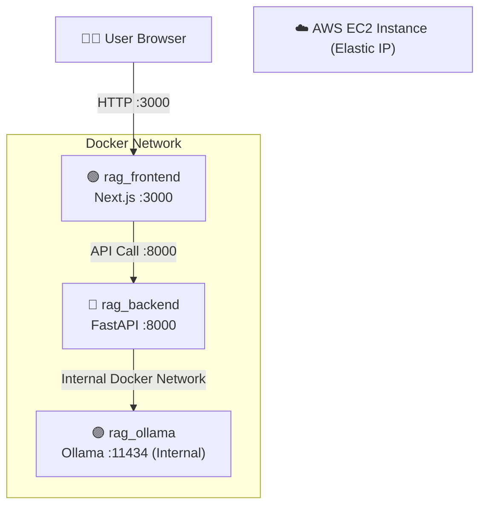
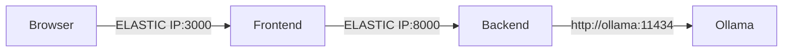
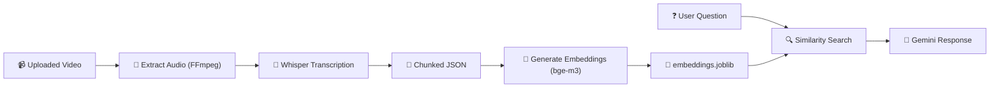

# 🚀 RAG-Based AI Teaching Assistant  
### Video → Transcription → Embeddings → Intelligent Q&A

A full-stack **Retrieval-Augmented Generation (RAG)** system that allows users to upload videos and ask intelligent questions based on their content.

Built with:

- ⚡ FastAPI
- 🟢 Next.js
- 🐳 Docker
- 🧠 Ollama (bge-m3 embeddings)
- 🎙 Whisper (Speech-to-Text)
- 🤖 Gemini API
- ☁️ AWS EC2 (Elastic IP Deployment) 

---

# 🏗 Architecture Overview

## 🔹 High-Level System Architecture



---


## 🌐 Network Flow (Public vs Internal)



---

# 🧠 RAG Processing Pipeline



---

# ✨ Features

- 🎥 Upload your videos
- 🎙 Automatic audio extraction using FFmpeg
- 📝 Speech-to-text transcription using Whisper
- 🧩 Intelligent text chunking
- 🔢 Embedding generation using bge-m3
- 💾 Persistent vector storage
- ❓ Ask contextual questions
- 🤖 Gemini-powered intelligent responses
- 🐳 Fully containerized architecture
- ☁️ Deployable on AWS EC2

---

# 🚀 Deployment (AWS EC2 with Elastic IP)

## 1️⃣ Launch EC2

- Instance: t3.large (8GB RAM minimum)
- OS: Ubuntu 24.04 LTS
- Open Ports:
  - 22 (SSH)
  - 3000 (Frontend)
  - 8000 (Backend)

---

## 2️⃣ Install Docker

```bash
sudo apt update && sudo apt upgrade -y
sudo apt install -y docker.io docker-compose-plugin
sudo systemctl enable docker
sudo systemctl start docker
sudo usermod -aG docker ubuntu
newgrp docker
```

---

## 3️⃣ Clone Repository

```bash
git clone https://github.com/your-username/Rag-based-ai-assistant.git
cd Rag-based-ai-assistant
```

---

## 4️⃣ Configure Environment Variables

### Backend (`backend/.env`)

```
GEMINI_API_KEY=your_key
```

### Frontend (`frontend/.env.production`)

```
NEXT_PUBLIC_API_URL=http://<YOUR_ELASTIC_IP>:8000
```

### Root (`.env`)

```
NEXT_PUBLIC_API_URL=http://<YOUR_ELASTIC_IP>:8000
```

---

## 5️⃣ Start Application

```bash
docker compose up -d --build
```

Verify:

```bash
docker ps
```

---

## 6️⃣ Access Application

Frontend:

```
http://<YOUR_ELASTIC_IP>:3000
```

Backend Docs:

```
http://<YOUR_ELASTIC_IP>:8000/docs
```

---

# 📂 Project Structure

```
Rag-based-ai-assistant/
│
├── backend/
│   ├── app/
│   ├── data/
│   ├── Dockerfile
│
├── frontend/
│   ├── app/
│   ├── Dockerfile
│
├── docker-compose.yml
└── README.md
```

---
# 🌐 Live Deployment Links

My public links:

### 🔹 Backend (Swagger Docs)
```
http://54.79.153.24:8000/docs
```

### 🔹 Frontend Application
```
http://54.79.153.24:3000/
```

---

# 👩‍💻 Author

Shivangini Singh  
Full Stack Developer | AI Systems Builder

---

# ⭐ If You Like This Project

Give it a ⭐ on GitHub!
